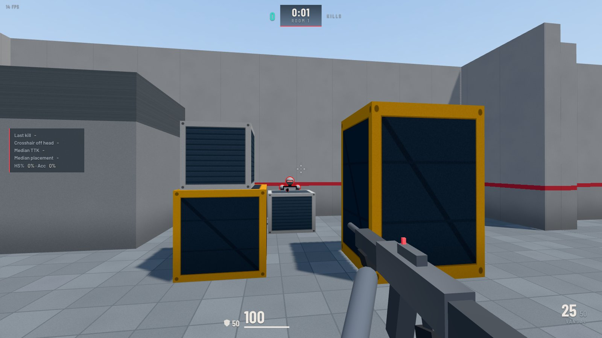
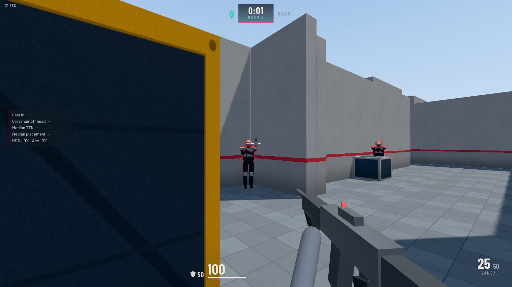

# Endless Peek

An endless hallway of held angles. Bots hide in random corners, alcoves, doorways and behind cover, and react like players the moment any part of you shows. You clear it the way you'd clear a site in VALORANT: slice the pie, pre-aim head level, counter-strafe, and don't re-peek an angle that already saw you.

It runs in the browser. The camera, sensitivity, FOV, movement and weapons use VALORANT's real numbers, so your muscle memory carries over in both directions.



## Play

```sh
npm install
npm run dev
```

Open the printed URL in **Chrome or Edge**, set your VALORANT sensitivity on the Mouse tab, paste your crosshair code on the Crosshair tab, and press **PLAY**. The game goes fullscreen and locks the mouse; `Esc` pauses.

To host it, see [GitHub Pages](#deploy-to-github-pages) below.

## Why not a decompile

Decompiling VALORANT wasn't possible here. It's Riot's closed-source code, and the client sits behind the Vanguard kernel anti-cheat. Riot's terms also forbid reverse engineering, and nothing decompiled could be shared. So this is a clean-room rebuild: no Riot code or assets. Every gameplay number comes from published data, listed below, and all art and sound are generated in code.

## What matches VALORANT

| Mechanic | Value used | Source |
|---|---|---|
| Sensitivity | 0.07° per mouse count × sens, same for yaw and pitch | Community-verified constant (mouse-sensitivity.com) |
| Scoped sensitivity | 0.07 × sens × scoped multiplier ÷ zoom, one multiplier for every zoom | mouse-sensitivity.com (MDV 177.78%) |
| Raw input | `requestPointerLock({ unadjustedMovement: true })`: raw counts on Chrome/Edge (Windows, macOS) and Firefox 152+ | Chromium and Firefox source |
| FOV | Fixed 16:9 frame, 103° × 70.53°. Other aspect ratios are letterboxed (or stretched, your choice) | Community-verified |
| ADS FOV | 103° ÷ zoom (1.25x ADS = 82.4°, Operator 2.5x/5x = 41.2°/20.6°) | Community-verified |
| Simulation rate | 128 Hz fixed tick with interpolated rendering; mouse look applied every frame | Riot netcode blog |
| Run speed | 6.75 m/s × weapon class (5.73 / 5.40 / 5.13 / 5.06 m/s); knife out is fastest | Game data, build 13.06 |
| ADS move speed | ×0.76 (Marshal ×0.90, Outlaw ×0.80, Operator ×0.72) | Game data |
| Acceleration and stopping | Unreal Engine CharacterMovement defaults (2048 cm/s²) with ground friction fitted so a counter-strafe from 5.4 m/s reaches 25% speed in 0.104 s and stops in 0.160 s | Riot's published counter-strafe timings |
| Accuracy deadzone | Full accuracy at or below 27.5% of max speed (Operator 15%); movement error ramps with actual speed | Patch notes 3.0 and 1.09 |
| Movement error | Per weapon: crouch-walk / walk / run / airborne (Vandal +0.8° / +3° / +6° / +10°), +7° for 0.225 s after landing | Game data, patch notes |
| Spread | First-shot and max error per weapon and per ADS mode; centre-biased when still, uniform while moving | Game data, patch 6.11 |
| Weapons | All 20 guns plus the knife: fire rate, damage by range (fractions rounded down), magazine, reserve, reload, equip, wall-pen tier, ADS zoom, burst modes (Bulldog, Stinger, Classic right-click), recovery time, tap efficiency, protected bullets, yaw-switch chance/time | Game build 13.06, checked by an automated test against the game data |
| Shields | Light and heavy shields absorb 66% of each hit until 25 / 50 points are absorbed | Game item text, patch 9.10 |
| Kill thresholds | Vandal one-taps and 4-body-shots heavy shields; Phantom one-taps inside 20 m only; Sheriff 3 body; Operator 1 body | Falls out of the two rows above (tested) |
| Tagging | Getting hit slows you by 72.5% | Patch 3.0 |
| Crosshair | VALORANT profile codes import and export, including the ADS and sniper sections, colours, outlines, centre dot, inner and outer lines, movement and firing error, fade | Matches the open-source parsers LilyBergonzat/Crosshair and @valapi/crosshair |
| Enemy highlight | Red, yellow or purple outline | In-game options |

## What is estimated

Riot has never published these, so they're best estimates. Each one is a named constant in `src/config/`, marked `est.`, so you can tune it after testing in the Range:

- **Recoil kick per bullet.** The structure is real: deterministic opening, protected bullets, yaw-switch chance and time, and where the spread peaks. The degrees per bullet are hand-tuned to match how the sprays look.
- **Walk speed** (0.56 × run), **crouch speed** (0.4 × run), **jump** (about 1 m apex), gravity, air control, crouch transition time.
- **Body and hitbox sizes.** Head centres sit at your eye height (1.62 m). On flat ground, a crosshair at your own eye level is head level, the same rule that holds in VALORANT.
- **Tag duration**, and recovery time for a few guns Riot never listed.
- **Bot reaction times.** Riot quotes about 247 ms for average human reaction; the difficulties range from 520 ms (Easy) to 170 ms (Radiant).

## The hallway

- Built from procedural segments that never repeat: corridors with alcoves and wall cover, rooms with crates, stacks, pillars and raised platforms, zigzag chicanes, and pillar halls. Exits go straight or turn left or right.
- Each segment hides 0 to 4 bots, with a density setting. Some rooms are empty, so you can't autopilot.
- Bots hold real angles: close door corners, deep alcove corners, off the edge of cover, head-only over crates, high ground, tight corners behind partitions, and long angles.
- **Bots react like players.**
  - Once any part of you is visible inside their field of view, they react after their reaction time, flick to you, and shoot in short bursts. Their aim error grows with your sideways speed.
  - If you show yourself and pull back, the bot stays pre-aimed and reacts faster on your re-peek.
  - **Running is loud.** Footsteps, landings and gunfire alert nearby bots. Shift-walking and crouching are silent.
  - Only bots in the next segment or closer are awake, so you never get picked off down a 60 m sightline you can't play.
- **Survival:** one life, go as deep as you can. Best run per difficulty is saved. **Practice:** deaths are counted and the run continues.
- Each new segment refills HP, shields and ammo by default, like a new round. You can turn that off.

### Stats that matter for peeking

- **Time to kill**, measured from the moment a bot first appears on your screen, not from when you fire.
- **Crosshair placement**: how many degrees your crosshair was off its head when it appeared.
- **Saw them first**: how often you had a bot on screen before it saw you.
- **Death recap**: the angle you died to, its reaction time, how long you were exposed, and whether you peeked it blind.
- **Slowest angle type** across the run.



## Controls (VALORANT defaults, rebindable)

| Action | Key |
|---|---|
| Move | W A S D |
| Walk (silent) | Left Shift |
| Crouch | Left Ctrl |
| Jump | Space |
| Fire / Alt fire, ADS, scope | Left / Right mouse |
| Reload | R |
| Primary / Secondary / Knife | 1 / 2 / 3 |
| Show stats | Tab (hold) |
| Restart run | P |
| Pause | Esc |

ADS, scope, walk and crouch can each be hold or toggle. In toggle mode the Operator cycles 2.5x, 5x, then off.

## Tips for the closest feel

- **Use Chrome or Edge on Windows or macOS.**
  - These give true raw input; the Mouse tab tells you whether it's active.
  - On Linux, or if raw input isn't available, set your OS pointer speed to the default with no acceleration (Windows 6/11, Enhance Pointer Precision off).
- **Play fullscreen.**
  - The game locks the keyboard there, so crouch + W (Ctrl+W) can't close the tab.
  - Firefox can't block Ctrl+W; rebind crouch there, or rely on the leave-page prompt.
- **Expect a frame-rate cap.** Browsers cap at your monitor's refresh rate. A 144 Hz+ monitor helps more than anything else.

## Development

```sh
npm run dev        # dev server
npm test           # unit tests (vitest)
npm run typecheck  # TypeScript
npm run build      # typecheck + production build into dist/
npm run check      # all of the above
```

| Folder | What's in it |
|---|---|
| `src/config/` | The numbers: `weapons.ts` (game data, plus estimated recoil), `agent.ts` (movement, shields, hitboxes), `settings.ts` |
| `src/core/` | View and sensitivity math, input with pointer lock, RNG |
| `src/physics/` | Ray/AABB tests and swept-box collision |
| `src/player/` | Unreal-style movement and the player body |
| `src/weapons/gun.ts` | Fire cadence, heat-based spread, recoil and recovery, ADS and scopes, bursts, reloads |
| `src/bots/bot.ts` | Perception, reaction, hearing, re-peek memory, burst fire |
| `src/world/` | The endless hallway: segment builders, joint rules, streaming and sealing |
| `src/render/` | Three.js level meshes, procedural textures, bot mannequins with outline, viewmodel, effects |
| `src/ui/` | HUD, menus, crosshair renderer and code parser |
| `tests/` | Unit tests, including the weapon table checked against `tests/fixtures/weapons-13.06.json` (extracted from the game data) |

`?debug` in the URL exposes `window.__ep`, a small scripting API used by the automated browser checks.

## Deploy to GitHub Pages

1. In the repository settings, open **Pages** and set **Source** to **GitHub Actions**.
2. Push to `main`, or run the **Deploy to GitHub Pages** workflow by hand.

The build uses relative paths, so it works from any sub-path.

## Legal

Endless Peek is a fan-made practice tool. It isn't affiliated with or endorsed by Riot Games. VALORANT is a trademark of Riot Games, Inc. This project contains no Riot code, models, textures or sounds.
